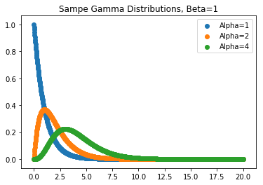

# Exponential and Gamma Distributions

### Motivations and Background
The exponential distribution is often used to model the failure of electronic components.
The distribution has a memoryless property where the probability of an event occuring in the next X amount of time is the same regardless of where we choose to start the time interval. Fuses for example follow this property. (Hence why the distribution is useful for electronic components.) The probability of a fuse breaking is actually the same regardless of whether the fuse is brand new or a year old (the memoryless property mentioned).

### Theory
The exponential distribution is a special case of a larger family of functions known as the gamma function.  
The gamma distribution is defined as:    
$f(y) = \frac{y^{\alpha-1}e^{-y/\beta}}{\beta^\alpha\Gamma(\alpha)}$   
  
with $\alpha > 0$ and $\beta > 0 $. 

Note that $\Gamma(\alpha)$ itself is known as the gamma function, which is defined as:  

$\Gamma(\alpha) = \int_0^\infty y^{\alpha-1}e^{-y}dy = (\alpha-1)!$  


```python
import numpy as np
import math
import matplotlib.pyplot as plt
%matplotlib inline
```


```python
def gamma(alpha):
    return math.factorial(alpha-1)
def gamma_dist(y, alpha, beta):
    num_t1 = y**(alpha-1) 
    num_t2 = np.e**(-y/beta)
    num = num_t1*num_t2
    den = (beta**alpha)*gamma(alpha)
    return num/den
y = np.linspace(start = 0, stop=20, num=10**3)
for a in [1,2,4]:
    plt.scatter(y, [gamma_dist(yi, alpha = a, beta=1) for yi in y], label='Alpha={}'.format(a))
plt.legend()
plt.title('Sampe Gamma Distributions, Beta=1')
    
```


    Text(0.5,1,'Sampe Gamma Distributions, Beta=1')





Notice all of these distributions are particularly skewed.

The exponential distribution is the special case where $\alpha=1$ which yields:  
  
$f(y) = \frac{1}{\beta}e^{-y/\beta}$

**$\beta$ is the mean or average value of y.**

# Car Battery 
The probability that a car's battery dies is exponentially distributed with an average lifespan of 100,000 miles. If you drive an average of 10,000 miles per year, what is the probability that the car's battery will die in the first 5 years?


```python
#Your code and answer here
```

# Printer Insurance
The probability of a $200 printer breaking is exponentially distributed with mean of 3 years. If a manufactury sells a 1 year warranty that fully covers a broken printer, how much is the policy worth? 


```python
#Your code here
```

# Home Runs Revisited
Remember that the number of home runs that occur within a game can reasonably be modelled by a poisson distribution. When we have a number of occurrences that are modelled by a poisson distribution like this, the time between each occurence can be modelled as an exponential distribution! (Another very useful property to keep in mind going forward.)

The Yankees averaged 1.47 home runs per game in 2017. What is the probability that fans had to wait 3 games for the next home run?


```python
#Your code here
```
